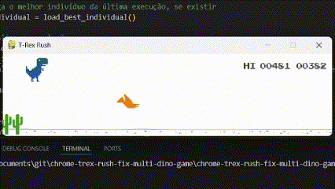

# Dinossauro Evolutivo com Algoritmo Genético

## Visão Geral
Este projeto tem como objetivo desenvolver um dinossauro evolutivo baseado no jogo do dinossauro do Google Chrome, utilizando algoritmos genéticos para maximizar a longevidade do dinossauro durante o jogo. O código foi implementado com a biblioteca Pygame e a MultiDinoGame, que permite múltiplos dinossauros jogarem simultaneamente. Este README detalha os algoritmos de seleção, mutação, crossover, e o comportamento geral do código.

## Algoritmo de Seleção

### Algoritmo Escolhido: Seleção por Torneio
A seleção por torneio foi escolhida para este projeto. Nesse método, um grupo de indivíduos é selecionado aleatoriamente da população, e o melhor indivíduo do grupo é escolhido para reprodução. O torneio é repetido várias vezes até selecionar os pais necessários.

**Por que foi escolhido?**
- Simples de implementar e eficiente, especialmente em populações pequenas.
- Evita a seleção de indivíduos com fitness muito baixo, permitindo uma melhor pressão seletiva.

**Diferencial em relação a outros métodos**
- Comparado à roleta, a seleção por torneio oferece maior controle sobre a pressão seletiva. A roleta pode favorecer muito os melhores indivíduos, enquanto o torneio oferece um equilíbrio entre diversidade e seleção de bons candidatos.

**Testes com outros algoritmos**
- **Roleta:** Ao testar o método de seleção por roleta, os resultados mostraram uma convergência mais rápida, porém, a população também ficou mais propensa a entrar em estagnação, devido à falta de diversidade genética.
- **Resultado:** O torneio apresentou uma evolução mais estável, promovendo uma melhoria consistente da população sem "congelar" no topo local.

## Algoritmo de Crossover

### Algoritmo Escolhido: Crossover de Um Ponto
O crossover de um ponto foi utilizado para combinar o material genético de dois pais, gerando dois filhos. Um ponto aleatório é selecionado nos cromossomos dos pais, e as partes subsequentes dos cromossomos são trocadas.

**Por que foi escolhido?**
- Simples de implementar e funciona bem em problemas com representação binária, como o utilizado aqui.

**Diferencial em relação a outros métodos**
- Comparado ao crossover de dois pontos, o de um ponto é menos propenso a gerar indivíduos com material genético muito diluído, mantendo a estrutura geral do cromossomo.

**Testes com outros algoritmos**
- **Crossover de Dois Pontos:** Foi testado, mas mostrou um maior risco de gerar filhos muito diferentes dos pais, diminuindo a chance de herdar características boas de forma efetiva.
- **Resultado:** O crossover de um ponto se mostrou mais eficiente para manter características importantes enquanto ainda promove a recombinação.

## Algoritmo de Mutação

### Algoritmo Escolhido: Mutação Bit Flip
A mutação ocorre ao inverter aleatoriamente alguns bits do cromossomo, com uma probabilidade de 5%.

**Por que foi escolhido?**
- O bit flip é uma técnica clássica e amplamente utilizada, ideal para representação binária.

**Diferencial em relação a outros métodos**
- Métodos mais complexos, como mutação por troca de segmentos, foram considerados excessivos para a simplicidade do problema.

**Testes com outros algoritmos**
- **Mutação Gaussiana:** A mutação gaussiana foi testada para ver se uma mudança mais contínua dos valores genéticos traria alguma vantagem, mas a natureza binária do cromossomo dificultou a aplicação efetiva desse método.
- **Resultado:** O bit flip se mostrou mais adequado para a simplicidade e precisão necessária ao problema.

## Comportamento do Código como um Todo
O algoritmo genético utilizado neste projeto mostrou-se eficiente para melhorar a performance do dinossauro no jogo, com evolução gradual e resultados consistentes após várias gerações. A combinação de seleção por torneio, crossover de um ponto, e mutação por bit flip proporcionou um bom equilíbrio entre diversidade genética e pressão seletiva. O código foi estruturado de maneira a garantir que a evolução do dinossauro ocorresse de forma contínua, com um loop principal que controla todas as etapas do algoritmo genético.

**Diferenciais**
- A implementação permite múltiplos dinossauros jogarem simultaneamente, o que facilita o processo de seleção e aumenta a eficiência do aprendizado do grupo.

**Limitações**
- Por ser baseado em uma representação binária dos cromossomos, algumas nuances de comportamento podem ser perdidas, e uma abordagem híbrida com uma rede neural foi considerada como próxima etapa, mas como não foi pedido dentro do escopo da atividade, não foi desenvolvido.

## Melhor Dinossauro

Score: 536.
